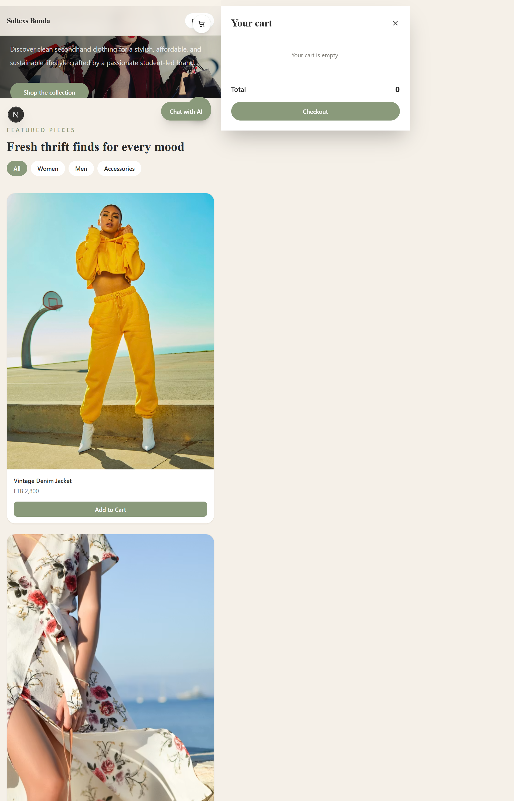
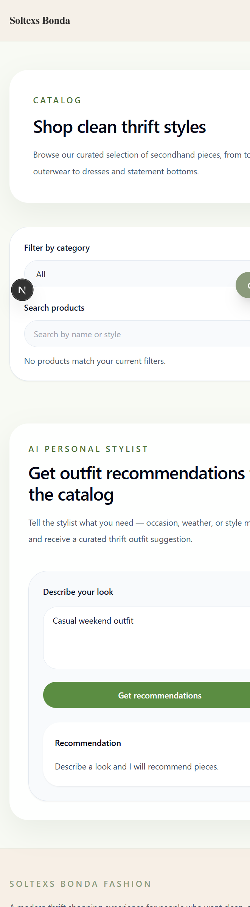
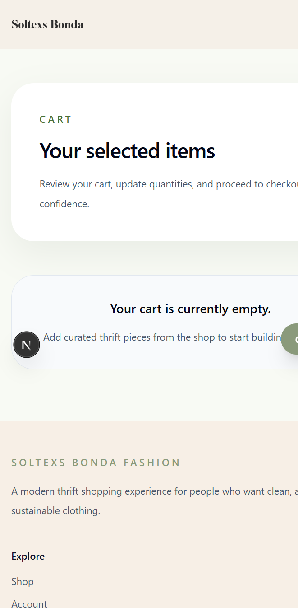

# Soltex-Fashion

Soltex-Fashion is a modern Next.js e-commerce storefront built for a curated thrift fashion brand. It combines a polished shopping experience with user authentication, Supabase-backed data storage, client-side cart persistence, and AI-powered styling assistance.

## Built with

- Next.js 15 (App Router)
- React 18
- TypeScript
- Tailwind CSS
- Supabase (authentication, database, storage)
- GROQ AI integration for optional stylist/chat features

## Key Features

- Home page with featured products and brand content
- Shop page with product browsing and filtering
- Product details page with image, size options, and add-to-cart action
- Client-side shopping cart stored in `localStorage`
- Email authentication with Supabase sign-in, sign-up, and magic links
- User profile and avatar upload support via secure server-side API routes
- Order creation and order history using Supabase backend
- Admin navigation available to approved admin email addresses
- AI-powered chat assistant and stylist recommendation widgets
- Server-side product loading using Supabase service role key

## Screenshots







> These screenshots were captured from the running local application. Replace these files with updated captures if the UI changes.

## App Pages

- `Home` — landing page for the brand, with hero messaging, an attractive hero image, featured product previews, and a quick link to the shop.
- `Shop` — live product catalog with filters, product cards, and an embedded `AI Stylist` recommendation panel for outfit suggestions.
- `Product details` — server-loaded product page showing images, description, prices, sizes, styling notes, and an add-to-cart button.
- `Cart` — client-side cart flow that persists items in `localStorage`, supports quantity changes, item removal, and checkout details.
- `Account` — authentication area with email sign-in, sign-up, magic link support, profile editing, avatar upload, and order history retrieval.
- `Admin` — protected admin area that only appears for authorized admin emails, with navigation to product, order, and settings management.
- `About` — brand story page with mission and value messaging to support the sustainable thrift concept.

## Feature walk-through

### Homepage
- Displays a clean hero section with brand name, tagline, and a CTA button.
- Includes featured collections and product teasers that highlight the storefront’s curated thrift style.
- Includes a fixed chat button for AI assistance and quick access to the shopping cart.

### AI styling
- The AI chat widget is available from every page as a floating chat bubble.
- The stylist panel on the shop page accepts style preferences and returns outfit recommendations.
- If `GROQ_API_KEY` is not set, the app falls back to local AI response templates from `lib/ai-fallback.ts`.

### Cart flow
- Users can add products from the shop or product details pages.
- The cart is stored in browser `localStorage`, so items remain across refreshes.
- Users can update quantity or remove items in the cart page before checkout.
- The checkout form submits an order to `app/api/orders/route.ts`, which saves the order to Supabase for authenticated users.

## Project Structure

- `app/` – Next.js page routes, layouts, API routes, and route handlers
- `components/` – Reusable UI components, auth forms, cart context, session context, and AI widgets
- `lib/` – Supabase client/server helpers, authentication cookie helpers, OpenAI/GROQ helpers, and AI fallback logic
- `public/` – Static assets (if present)
- `supabase-schema.sql` – Database schema for core app tables
- `supabase-schema-products.sql` – Product schema for the shop catalog

## Environment Variables

The app uses Supabase and optional AI services. Create a `.env.local` file at the project root and provide these values:

```env
NEXT_PUBLIC_SUPABASE_URL=your-supabase-url
NEXT_PUBLIC_SUPABASE_ANON_KEY=your-supabase-anon-key
SUPABASE_SERVICE_ROLE_KEY=your-supabase-service-role-key
GROQ_API_KEY=your-groq-api-key
NEXT_PUBLIC_ADMIN_EMAILS=biruktibebesol@gmail.com,admin@soltexs.com
```

### Notes

- `NEXT_PUBLIC_SUPABASE_URL` and `NEXT_PUBLIC_SUPABASE_ANON_KEY` are required for client-side Supabase operations.
- `SUPABASE_SERVICE_ROLE_KEY` is required for server-side Supabase reads and writes in secure API routes.
- `GROQ_API_KEY` is optional. If it is not provided, the AI chat and stylist assistant fall back to built-in responses.
- `NEXT_PUBLIC_ADMIN_EMAILS` controls which users see the admin navigation links.

## Local Development

Install dependencies and start the development server:

```bash
npm install
npm run dev
```

Open `http://localhost:3000` to view the app.

## Production Build

Build and preview production output locally:

```bash
npm run build
npm run start
```

## Authentication Flow

- Client-side auth uses `@supabase/supabase-js`
- `components/supabase-auth.tsx` handles sign-in, sign-up, password input, and magic links
- `components/session-token-context.tsx` stores session cookies and exposes current user state
- `lib/auth.ts` helps set and clear Supabase session cookies and resolve the user from requests

## Data and API Flow

- `lib/supabase-client.ts` creates a client-side Supabase instance
- `lib/supabase-server.ts` creates a server-side Supabase client using `SUPABASE_SERVICE_ROLE_KEY`
- Product pages load data from Supabase server-side for secure queries
- `app/api/orders/route.ts` handles order creation and retrieval for authenticated users
- `app/api/profile/route.ts` and `app/api/profile/avatar/route.ts` manage user profile data and avatar uploads

## AI Features

- `components/ai-chat-widget.tsx` provides a small customer support chat bubble
- `components/ai-stylist.tsx` provides a stylist recommendation form
- `app/api/ai/chat/route.ts` and `app/api/ai/stylist/route.ts` route AI requests through a GROQ endpoint if configured
- `lib/ai-fallback.ts` provides fallback responses when the AI API key is missing or unavailable

## Cart Persistence

- `components/cart-context.tsx` manages cart state in React context
- Cart items are persisted to `localStorage` under `bonda-cart`
- Cart totals and quantities are calculated from persisted items

## Admin and Access Control

- `components/session-token-context.tsx` determines whether a signed-in user is an admin using `NEXT_PUBLIC_ADMIN_EMAILS`
- `components/site-header.tsx` shows an admin link only for approved admin users

## Database Schema

The repository includes SQL files to model the database schema. Use these files when creating or migrating your Supabase database:

- `supabase-schema.sql`
- `supabase-schema-products.sql`

## Useful Scripts

- `npm run dev` – start development server
- `npm run build` – compile production build
- `npm run start` – run the production server
- `npm run lint` – run Next.js lint checks

## Deployment

This project is ready for deployment to Vercel, Netlify, or any platform that supports Next.js:

1. Set the same environment variables in your hosting provider.
2. Deploy the app.
3. Ensure the Supabase project is configured with the tables required by the SQL schema files.

## Contributing

If you want to contribute:

1. Fork the repository.
2. Create a feature branch.
3. Submit a pull request with a clear description of the change.

## License

No license has been specified in this repository.

